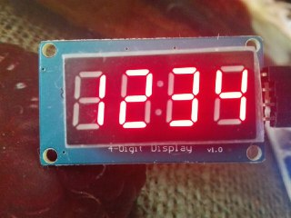

# TM1637 - Espruino (Iskra JS)

 * Module for display TM1637 on Espruino(Iskra JS)
 * Control a 4 digit led segments TM1637 driver using javascript
 * Adaptation from https://github.com/revolunet/tm1637
 
 ## Usage
 
```js
// P8 - CLK, P9 - DIO ports
var display = require('TM1637').connect(P8, P9);

display.show("1234");
``` 



# FIX
* 2021.07.25 Espruino 2v01.49